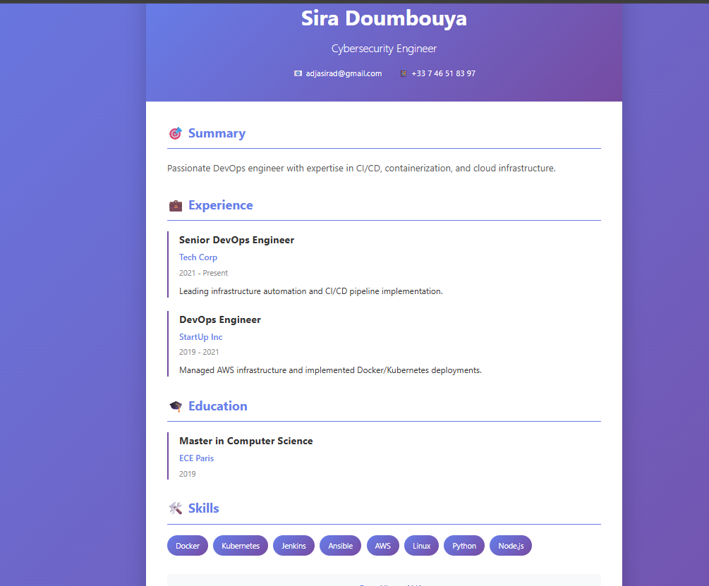
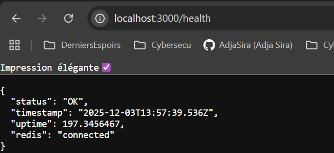
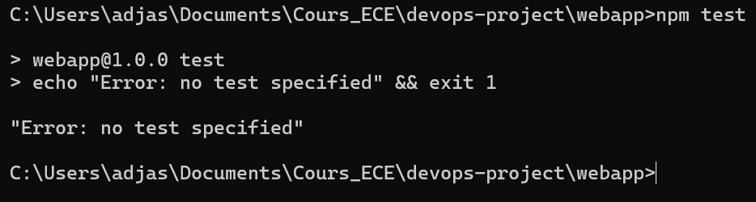

# Projet DevOps - Application Web CV


## 📋 Table des matières

- [Présentation](#présentation)
- [Membres de l'équipe](#membres-de-léquipe)
- [Fonctionnalités](#fonctionnalités)
- [Technologies](#technologies)
- [Installation](#installation)
- [Utilisation](#utilisation)
- [Tests](#tests)
- [CI/CD](#cicd)
- [Docker](#docker)
- [Infrastructure (Vagrant/Ansible)](#infrastructure-vagrantansible)
- [Kubernetes](#kubernetes)
- [Captures d'écran](#captures-décran)
- [Liens](#liens)
- [Auteur](#auteur)

---

## 🎯 Présentation

Application web DevOps complète comprenant :
- Application web affichant un CV
- Tests automatisés
- Pipeline CI/CD avec GitHub Actions
- Conteneurisation Docker
- Infrastructure as Code (Vagrant + Ansible)
- Déploiement Kubernetes

---

## 👥 Membres de l'équipe

- **[Adja Sira DOUMBOUYA]** - [adjasira.doumbouya@edu.ece.fr]
- **[Mohamed KA]** - [mohamed.ka@edu.ece.fr]

---

## ✅ Fonctionnalités

### Application Web ✅
- [x] Serveur Express.js
- [x] Affichage du CV avec interface moderne
- [x] Intégration Redis (compteur de vues)
- [x] Endpoint de santé `/health`
- [x] API REST `/api/views`
- [x] Tests automatisés (8 tests)

### CI/CD 🚧
- [ ] GitHub Actions
- [ ] Tests automatiques
- [ ] Déploiement automatique

### Docker 🚧
- [ ] Dockerfile
- [ ] Image sur Docker Hub

### Infrastructure 🚧
- [ ] VM Vagrant
- [ ] Provisioning Ansible

### Kubernetes 🚧
- [ ] Manifests K8s
- [ ] Déploiement Minikube

---

## 🛠️ Technologies

- **Backend :** Node.js, Express.js
- **Base de données :** Redis
- **Tests :** Mocha, Chai, Supertest
- **CI/CD :** GitHub Actions
- **Conteneurs :** Docker
- **IaC :** Vagrant, Ansible
- **Orchestration :** Kubernetes

---

## 🚀 Installation

### Prérequis

- Node.js (v14+)
- npm
- Git
- Redis (optionnel)

### Windows

**1. Installer Node.js**
- Télécharger sur [nodejs.org](https://nodejs.org/)
- Vérifier : `node --version`

**2. Installer Git**
- Télécharger sur [git-scm.com](https://git-scm.com/)
- Vérifier : `git --version`

**3. Redis (Optionnel)**

Option A - WSL2 :
```cmd
wsl --install
sudo apt install redis-server
sudo service redis-server start
```

Option B - Docker :
```cmd
docker run -d -p 6379:6379 --name redis redis:alpine
```

**4. Cloner et installer**
```cmd
git clone https://github.com/AdjaSira/devops_project.git
cd devops-project/webapp
npm install
npm test
npm start
```

### Linux/MacOS

**1. Installer Node.js**

Ubuntu/Debian :
```bash
curl -fsSL https://deb.nodesource.com/setup_18.x | sudo -E bash -
sudo apt-get install -y nodejs
```

MacOS :
```bash
brew install node
```

**2. Installer Git**
```bash
sudo apt install git  # Ubuntu/Debian
brew install git      # MacOS
```

**3. Installer Redis (Optionnel)**
```bash
sudo apt install redis-server  # Ubuntu/Debian
brew install redis             # MacOS
brew services start redis      # MacOS
```

**4. Cloner et installer**
```bash
git clone https://github.com/AdjaSira/devops_project.git
cd devops-project/webapp
npm install
npm test
npm start
```

Accéder à : `http://localhost:3000`

---

## 📖 Utilisation

### Démarrer l'application

```bash
cd webapp

# Mode développement (avec auto-reload)
npm run dev

# Mode production
npm start

# Port personnalisé
PORT=8080 npm start
```

### Variables d'environnement

Fichier `.env` dans `webapp/` :
```env
PORT=3000
REDIS_HOST=localhost
REDIS_PORT=6379
```

### Endpoints disponibles

| Endpoint | Méthode | Description |
|----------|---------|-------------|
| `/` | GET | Page d'accueil CV |
| `/health` | GET | Vérification de santé (JSON) |
| `/api/views` | GET | Nombre de vues (nécessite Redis) |

---

## 🧪 Tests

### Lancer les tests

```bash
cd webapp
npm test
```

### Résultat attendu

```
8 passing (245ms)
✓ Homepage returns 200 OK
✓ CV content is displayed
✓ Health endpoint returns 200
✓ Health response has required fields
✓ View count API works
✓ 404 for unknown routes
✓ Valid package.json
✓ Express dependency present
```

---

## 🔄 CI/CD

**Statut :** 🚧 À venir

Pipeline prévu :
1. Build - Installation des dépendances
2. Test - Exécution des tests
3. Deploy - Déploiement automatique

---

## 🐳 Docker

**Statut :** 🚧 À venir

### Construire l'image
```bash
docker build -t devops-webapp:latest ./webapp
```

### Lancer le conteneur
```bash
docker run -p 3000:3000 devops-webapp:latest
```

**Lien Docker Hub :** À venir

---

## 🏗️ Infrastructure (Vagrant/Ansible)

**Statut :** 🚧 À venir

### Démarrer la VM
```bash
cd iac
vagrant up
```

### Provisionner avec Ansible
```bash
ansible-playbook -i inventory playbooks/deploy.yml
```

---

## ☸️ Kubernetes

**Statut :** 🚧 À venir

### Démarrer Minikube
```bash
minikube start
```

### Déployer l'application
```bash
kubectl apply -f k8s/
```

---

## 📁 Structure du projet

```
devops-project/
├── .github/workflows/    # CI/CD
├── webapp/
│   ├── src/
│   │   ├── views/
│   │   │   └── index.ejs
│   │   └── index.js
│   ├── test/
│   │   └── test.js
│   ├── package.json
│   ├── Dockerfile        # À venir
│   └── .env
├── iac/
│   ├── Vagrantfile       # À venir
│   └── playbooks/        # À venir
├── k8s/                  # À venir
├── image/                # Screenshots
├── README.md
└── PROJECT.md
```

---

## 📸 Captures d'écran

### Application en local


### Health Check


### Tests


---

## 🔗 Liens

- **GitHub :** [https://github.com/AdjaSira/devops_project.git](https://github.com/AdjaSira/devops_project.git)
- **Docker Hub :** À venir
- **Application déployée :** À venir

---

## 🎁 Bonus

- [ ] Utilisation d'outils différents (GitLab CI/CD, etc.)
- [ ] Fonctionnalités API supplémentaires
- [ ] Docker Compose
- [ ] Section commentaires
- [ ] Monitoring

---

## 👤 Auteurs

**[Adja Sira DOUMBOUYA]**
**[Mohamed KA]**
- GitHub : [@AdjaSira](https://github.com/AdjaSira)
- Email : adjasira.doumbouya@edu.ece.fr

**Année :** 2025-2026  
**École :** ECE Paris

---

